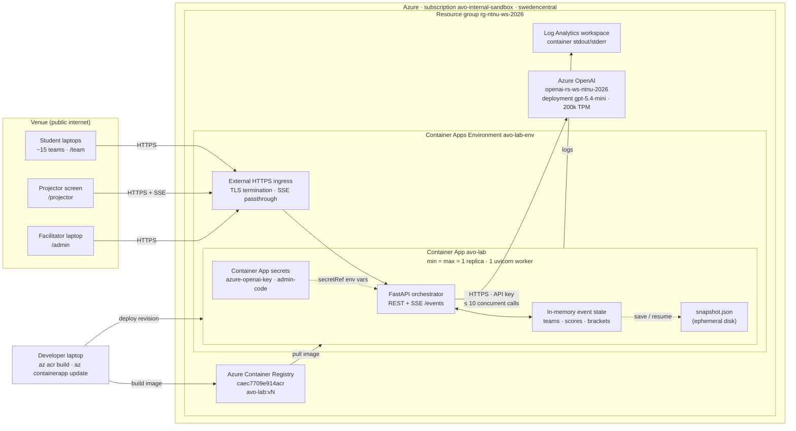

# Deploying to Azure Container Apps

The orchestrator is a single stateful process. That shapes everything below:
**one replica, never scaled to zero, never redeployed during the event.**

You do not need Docker running locally — `az containerapp up --source .` builds
the image remotely with ACR Tasks.

## Verified environment (checked 2026-08-05)

| | |
|---|---|
| subscription | `avo-internal-sandbox` |
| resource group | `rg-ntnu-ws-2026` (exists, `swedencentral`) |
| existing contents | `openai-rs-ws-ntnu-2026` — **the OpenAI resource. Do not delete this group.** |
| container app env | `avo-lab-env` |
| registry | `caec7709e914acr` (created by `containerapp up`) |
| providers | `Microsoft.App`, `Microsoft.OperationalInsights`, `Microsoft.ContainerRegistry` all registered |

**Live URL:** `https://avo-lab.lemonfield-d248f0b0.swedencentral.azurecontainerapps.io`

Verified after the first deploy: single replica pinned, secrets stored as
`secretRef` rather than plaintext, and **SSE streams through the ingress**
(`x-accel-buffering: no`, keepalive frames arriving 15s apart incrementally),
so the live leaderboard works in production.

**Do not run `az extension add --name containerapp`.** On Azure CLI 2.67 the
`containerapp` commands are part of the core CLI; the extension is obsolete and
its installer crashes pip on Windows (exit `3221225477` = access violation).
Nothing needs it.

## Infrastructure overview

Everything lives in one resource group in `swedencentral`. The app is a single
container behind the Container Apps ingress; it holds all event state in memory
and talks to Azure OpenAI over its public endpoint with an API key stored as a
Container Apps secret. There is no database, no VNet, no managed identity and
no persistent storage — the deliberate trade-offs for a one-day event.



What the infra owner should know:

* **Single replica by design.** All tournament state is in memory, so scaling
  out would split the event and scaling to zero would wipe it. Min and max
  replicas are pinned to 1 and the container runs one uvicorn worker.
* **No persistent storage.** `snapshot.json` is on ephemeral disk; it survives
  a crash but not a redeploy.
* **Key-based auth to Azure OpenAI**, injected via `secretRef`. No managed
  identity today; switching would be a small code change in `llm_client.py`.
* **Public endpoints only.** External ingress on the app, outbound to the
  Azure OpenAI public endpoint. No VNet integration or private endpoints.
* **SSE must not be buffered.** The live leaderboard streams over server-sent
  events; anything placed in front of the ingress (WAF, proxy) has to pass
  them through unbuffered.
* **The binding constraint is the OpenAI TPM quota, not compute.** The app
  caps itself at 10 concurrent model calls (`llm.max_concurrency`) to stay
  around 70 % of the 200k TPM quota. Raise the quota in Foundry to go faster.
* **Access control is application-level**: a join code for students and an
  admin code for the facilitator. No Entra login in front of the app.

---

## 1. Confirm the subscription

```bash
az account set --subscription avo-internal-sandbox
```

## 2. Build and deploy

Creates the registry, the environment and the app in one go. A few minutes the
first time. Run it from the repo root.

```bash
az containerapp up --name avo-lab --resource-group rg-ntnu-ws-2026 --location swedencentral --environment avo-lab-env --source . --ingress external --target-port 8000
```

It prints a URL like `https://avo-lab.<hash>.swedencentral.azurecontainerapps.io`.
The app is live but in mock mode with default codes — that's the next two steps.

## 3. Store the secrets

Never pass these as plain env vars; they show up in `az containerapp show`.

```bash
az containerapp secret set --name avo-lab --resource-group rg-ntnu-ws-2026 --secrets bifrost-virtual-key="<your BIFROST_VIRTUAL_KEY>" admin-code="<your ADMIN_CODE>"
```

The virtual key comes from Bifrost → Virtual Keys (the one scoped to this
project, with its own budget). If you ever need to bypass the gateway, store
`azure-openai-key` the same way and use the Azure variant of step 4.

## 4. Configuration, and pin to a single replica

`--min-replicas 1 --max-replicas 1` is the part that matters. Two replicas means
two independent tournaments and a round-robin that silently splits in half.

```bash
az containerapp update --name avo-lab --resource-group rg-ntnu-ws-2026 --min-replicas 1 --max-replicas 1 --set-env-vars LLM_MODE=bifrost BIFROST_BASE_URL="https://<your-bifrost-host>" BIFROST_MODEL=azure/gpt-5.4-mini JOIN_CODE=HYBRIDA2026 BIFROST_VIRTUAL_KEY=secretref:bifrost-virtual-key ADMIN_CODE=secretref:admin-code
```

Azure-direct variant, if the gateway is ever unavailable:

```bash
az containerapp update --name avo-lab --resource-group rg-ntnu-ws-2026 --min-replicas 1 --max-replicas 1 --set-env-vars LLM_MODE=azure AZURE_OPENAI_ENDPOINT="https://openai-rs-ws-ntnu-2026.openai.azure.com" AZURE_OPENAI_DEPLOYMENT=gpt-5.4-mini AZURE_OPENAI_API_VERSION=2024-12-01-preview JOIN_CODE=HYBRIDA2026 AZURE_OPENAI_API_KEY=secretref:azure-openai-key ADMIN_CODE=secretref:admin-code
```

## 5. Confirm it came up correctly

```bash
az containerapp logs show --name avo-lab --resource-group rg-ntnu-ws-2026 --tail 40
```

Look for the startup banner reporting `mode bifrost (azure/gpt-5.4-mini)`, join code
`HYBRIDA2026`, and **no** `ADMIN_CODE is still the default` warning.

```bash
az containerapp show --name avo-lab --resource-group rg-ntnu-ws-2026 --query "properties.configuration.ingress.fqdn" --output tsv
```

---

## Post-deploy checklist

The first two are the ones that actually bite.

1. **SSE really streams.** Open `/projector`, then run a group stage from
   `/admin`. The leaderboard must tick up continuously. If it sits still and
   jumps at the end, the ingress is buffering and the spectacle is dead — the
   projector would need switching to polling.
2. **Scale is pinned.** This must show exactly one active replica:

```bash
az containerapp revision list --name avo-lab --resource-group rg-ntnu-ws-2026 --output table
```

3. **Full rehearsal against the deployed URL**, not localhost: join two teams,
   fire a Gatekeeper attack, run a small group stage, run a playoff match.
4. **Latency sanity.** The app and Azure OpenAI are both in swedencentral, so
   expect the same ~0.77s per call measured locally.

## Things to know

**State is in memory and `snapshot.json` is on ephemeral disk.** It survives a
process crash — that is what *Resume from snapshot* is for. It does **not**
survive a redeploy or a replica move. So: no `az containerapp up` while the
workshop is running, for any reason.

**`config.yaml` is baked into the image.** Live tuning from the admin panel
(deal bonus, concurrency, message delay) applies to the running process only and
is lost on restart. Anything permanent must be edited and redeployed *before*
the event.

**Scale-to-zero is off deliberately.** With `min-replicas 1` you pay for a
container running continuously. For a one-day event that is small, and a cold
start mid-tournament would lose the entire game state.

**Rollback.** Container Apps keeps revisions:

```bash
az containerapp revision activate --revision <previous-revision-name> --resource-group rg-ntnu-ws-2026
```

## Teardown — delete the app, NOT the resource group

`rg-ntnu-ws-2026` contains `openai-rs-ws-ntnu-2026`, the Azure OpenAI resource.
Deleting the group destroys the model deployment along with it. Remove only what
this deployment added:

```bash
az containerapp delete --name avo-lab --resource-group rg-ntnu-ws-2026 --yes
```

```bash
az containerapp env delete --name avo-lab-env --resource-group rg-ntnu-ws-2026 --yes
```

`containerapp up` also creates a container registry with a generated name. List
it and delete it separately:

```bash
az acr list --resource-group rg-ntnu-ws-2026 --query "[].name" --output tsv
```

## The deployed app is the only way the workshop runs

There is deliberately no laptop-on-the-venue-Wi-Fi fallback. It would not have
bought anything: the orchestrator has to reach Azure OpenAI either way, so if the
venue's internet is down the workshop is over regardless of where the app runs.
Meanwhile it added a failure mode nobody can fix in the room — most guest
networks block device-to-device traffic, so student laptops often cannot reach a
laptop at all.

Running locally is a development tool (see `RUN.md`), not a plan B.
